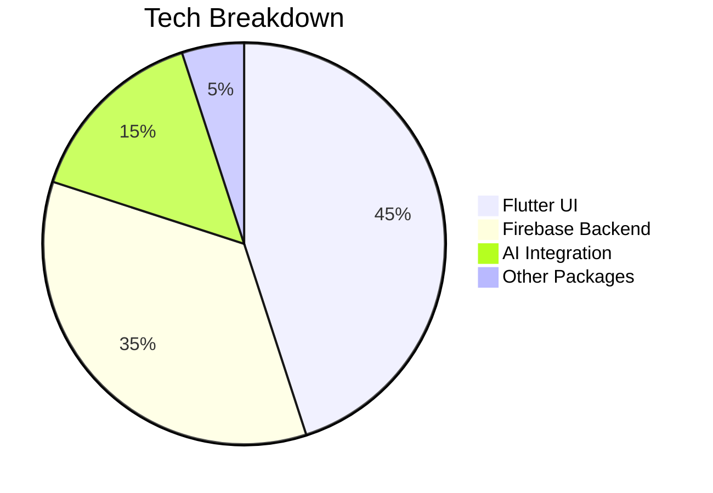

---

# 🎓 ExamCollectors  
*Your All-in-One University Survival Kit*  

  
*(Replace with actual screenshots of your app)*  

---

## 🌟 **Project Vision**  
**Problem:** University students struggle to find past exams, track grades, and stay organized.  
**Solution:** A single Flutter app that combines:  
- **📂 Exam Vault:** Crowdsourced past papers + quizzes  
- **🧮 Grade Predictor:** "What-if" score scenarios  
- **⏳ Smart Study Tools:** Pomodoro, note-taking, AI tutor  
- **👥 Community Hub:** Course-specific study groups  

Built with **Flutter + Firebase** for seamless cross-platform performance.  

---

## 🚀 **Key Features**  

| Feature | Why Students Love It |  
|---------|----------------------|  
| **Exam Database** | Find past papers by course/professor with peer-reviewed solutions |  
| **Grade Calculator** | "If I score 80% on the final, my GPA becomes..." instantly |  
| **Pomodoro Pro** | Custom timer with session analytics |  
| **AI Study Buddy** | Get explanations for tough questions (GPT-3.5 powered) |  
| **Professor Finder** | Rate and discover tutors in your faculty |  

*(Tip: Add GIFs/videos showcasing each feature in action)*  

---

## 🛠 **Tech Stack**  



**Core Packages:**  
- `firebase_core`: Auth + Firestore  
- `provider`: State management  
- `flutter_markdown`: Format study notes  
- `shared_preferences`: Local caching  

---

## ⚡ **Quick Setup**  

### 1. **Clone & Install**  
```bash  
git clone https://github.com/Yado-D/ExamCollectors.git  
cd ExamCollectors  
flutter pub get  
```  

### 2. **Firebase Setup** *(3 minutes)*  
1. Create a Firebase project  
2. Add your app (Android/iOS) → Download config files  
   - Android: `google-services.json` → `/android/app`  
   - iOS: `GoogleService-Info.plist` → `/ios/Runner`  

### 3. **Run!**  
```bash  
flutter run  
```  

> 💡 **Pro Tip:** Enable Firebase Auth (Email/Google) and Firestore before testing!  

---
📜 License
MIT License - See LICENSE for details.

## 📈 **Why This Matters**  
- **Freshmen:** Hit the ground running with past exams  
- **Seniors:** Graduate with confidence using grade tracking  
- **Everyone:** Study smarter with AI + community support  

 
