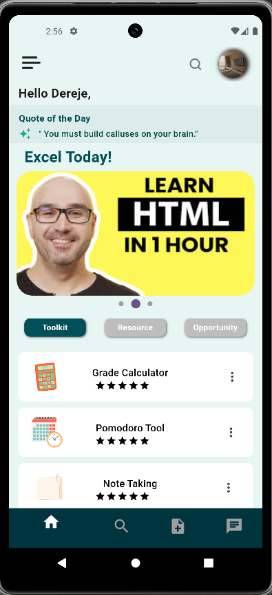
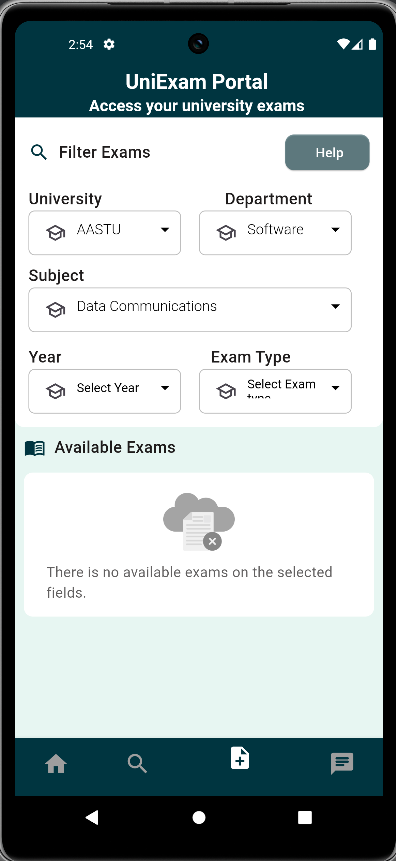
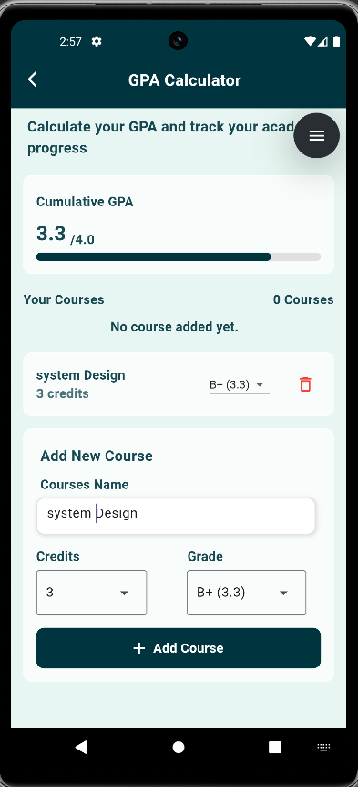
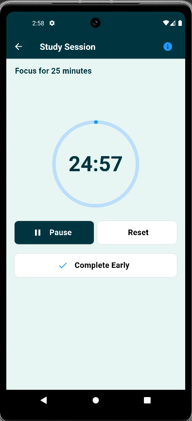

# 📚 ExamCollectors  
*Your Ultimate Academic Companion*  

  

  <a href="#-features">Features</a> •
  <a href="#-screenshots">Screenshots</a> •
  <a href="#-installation">Installation</a> •
  <a href="#-usage">Usage</a> •
  <a href="#-dependencies">Dependencies</a> •
  <a href="#-license">License</a> •
  <a href="#-about-the-developer">About</a>

**ExamCollectors** is a comprehensive Flutter app designed to empower university students throughout their academic journey. From accessing past exams to AI-powered study assistance, this all-in-one tool helps you study smarter, track grades, and connect with peers.

---

## ✨ Features  

### 📂 **Exam Vault**  
- 🗃️ Largest crowdsourced collection of past papers and quizzes  
- 🔍 Search by course code, professor, or semester  

### 📊 **Grade Predictor**  
- 🎯 "What-if" GPA scenarios with real-time calculations  
- 📈 Visual grade breakdowns by assignment type  

### ⏳ **Study Toolkit**  
- � Pomodoro timer with session analytics  
- ✏️ Cornell note-taking templates  
- 🃏 Flashcard generator  

### 🤖 **AI Study Buddy**  
- 💡 Instant homework help (GPT-3.5 powered)  
- ✍️ Essay feedback and concept explanations  

### 👥 **Campus Connect**  
- 🎓 Course-specific study groups  
- ⭐ Professor ratings and office hour tracking  

---

## 📱 Screenshots  

  <table>
    <tr>
      <td></td>
      <td></td>
      <td></td>
      <td></td>
    </tr>
    <tr align="center">
      <td>Home</td>
      <td>Exam Browser</td>
      <td>Grade Calculator</td>
      <td>Pomodoro Timer</td>
    </tr>
  </table>

---

📜 License
MIT License - See LICENSE

👨‍💻 About the Developer

ExamCollectors was created by Yared Dereje, a passionate Flutter developer and former university student dedicated to making academic success accessible to all. This project combines technical excellence with firsthand understanding of student struggles.

📬 Contact
For support, collaborations, or feedback:

✉️ Email: yareddereje780@gmail.com

🐞 GitHub Issues: Open an issue

💼 LinkedIn: Yared Dereje

 <h3>Let's build the future of education together! 🚀</h3> 
 
   
